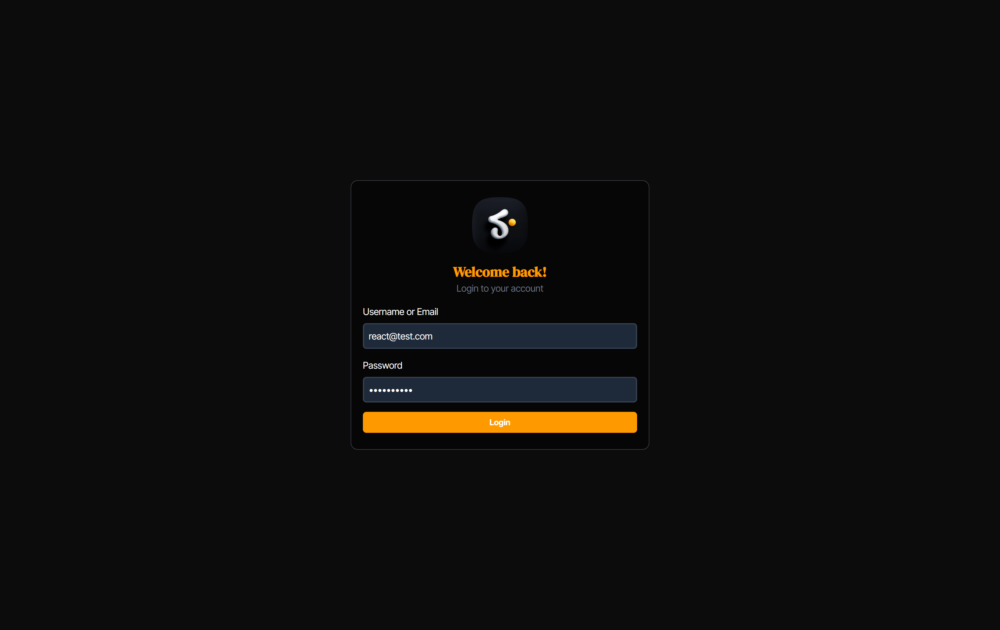
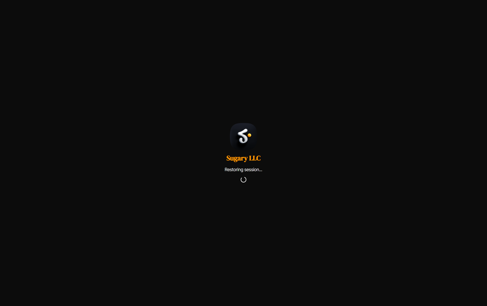
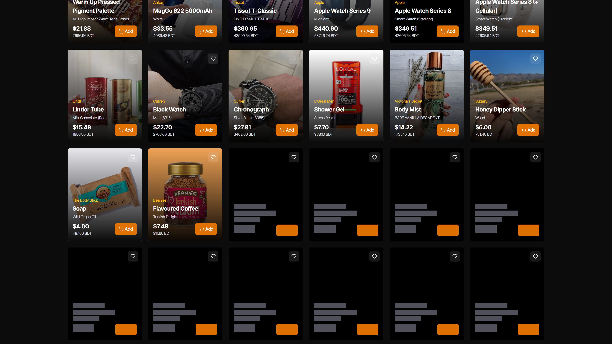

# **Sugary React Recruitment Project**

_A modern admin portal with secure authentication and interactive materials management_  
**Live Demo**: [Here (Hosted on netlify)](https://sugaryreact.netlify.app/)

**Login page**


**Previous login session restore**


**Dashboard**


**Dashboard with skeleton**


## **✨ Features**

### **🔐 Secure Authentication**

- Refresh token based auth handling
- Persistent sessions using local storage
- Automatic token revalidation on app reload
- Protected routes with redirects

### **📊 Interactive Dashboard**

- Lazy-loaded materials list with infinite scroll
- Smooth card animations using [Motion](https://motion.dev/)
- Responsive grid layout (mobile to 4K)
- Skeletons for loading states

### **🎨 Thoughtful UI/UX**

- Custom toast notifications with status icons
- Adaptive color scheme with amber accents
- Optimized image loading with CDN support
- Pixel-perfect spacing and typography

### **⚡ Performance Optimizations**

- Memoized API calls with axios interceptors
- Efficient IntersectionObserver for infinite scroll
- Minimal re-renders with proper state management
- Code-split routes for faster loading

## **🛠 Tech Stack**

- **Frontend**: [React 19](https://react.dev/) + [TypeScript](https://www.typescriptlang.org/) + [Vite](https://vite.dev/)
- **State**: [Redux Toolkit](https://redux-toolkit.js.org/) with persistence
- **Styling**: [Tailwind CSS](https://tailwindcss.com/) with custom themes
- **Animation**: [Motion](https://motion.dev/)
- **Routing**: [React Router](https://reactrouter.com/)
- **Icons**: [Lucide React](https://lucide.dev/guide/packages/lucide-react)

## **🚀 Getting Started**

1. **Clone the repo**

   ```bash
   git clone https://github.com/alraakib/sugary-react-recruitment.git
   ```

2. **Install dependencies**

   ```bash
   npm install
   ```

3. **Configure environment**  
   Create `.env` file:

   ```env
   VITE_API_URL="https://sugarytestapi.azurewebsites.net"
   VITE_CDN_URL="https://d1wh1xji6f82aw.cloudfront.net"
   ```

4. **Run the app**
   ```bash
   npm run dev
   ```

## **🔍 Implementation Highlights**

### **Authentication Flow**

```ts
// Custom axios instance with token refresh
authAxios.interceptors.request.use((config) => {
  const token = store.getState().auth.RefreshToken;

  if (token) {
    config.headers.Authorization = `Bearer ${token}`;
  }

  return config;
});
```

### **Infinite Scroll Logic**

```tsx
// Smart pagination with IntersectionObserver
new IntersectionObserver(
  (entries) => {
    if (entries[0].isIntersecting && remaining > 0) {
      setFilter((prev) => ({ ...prev, Skip: prev.Skip + prev.Limit }));
    }
  },
  { threshold: 0.1, rootMargin: "-500px 0px 0px 0px" }
);
```

## **📂 Project Structure**

```
src/
├── components/      # Reusable UI components
├── pages/           # Route-based pages
├── store/           # Redux toolkit setup
├── types/           # TypeScript interfaces
├── libs/            # Utility functions
└── App.tsx          # Main router
```

## **📝 Notes**

- Designed for the Sugary LLC recruitment process
- All API endpoints and information provided in the [Sugary Recruitment Assignment](https://github.com/TeamSugary/react-recruitment-assignment)
- Focused on clean code and maintainability

---
